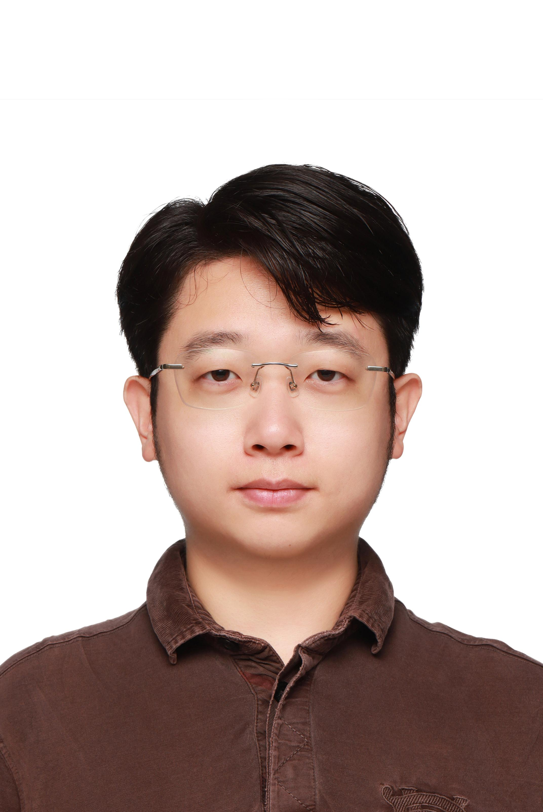
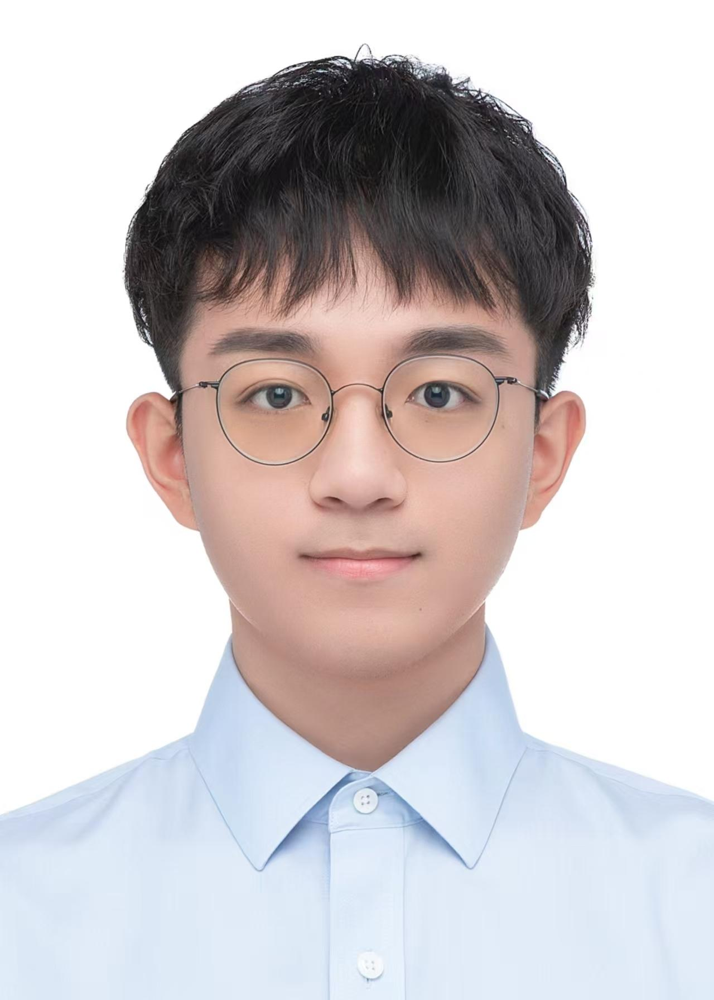

# Research Team

[← Back to Homepage](./index.md)

---

## Senior Researchers

<h3>Rulin Feng (冯儒林)</h3>

**Assistant Researcher** — MC-PDFT  
[Profile](../members/rlfeng.md)

<h3>Wenjie Yan (颜文杰)</h3>

**Assistant Researcher** — ML algorithms, XPaiNN, REST workshops  
[Profile](../members/wjyan.md)

<h3>Andrew J. Zhu (祝震予)</h3>

**Postdoctoral Fellow** — GPU algorithms, REST optimization  
[Profile](../members/zyzhu.md)

<h3>Shengyang Cai (蔡升阳)</h3>

**Postdoctoral Fellow** — XO-REST for complex biosystems  
[Profile](../members/sycai.md)

---

## PhD & Master Students

<h3>Yajing Li (李亚静)</h3>

**PhD Student** — Enhanced sampling, XPaiNN ML potentials  
[Profile](../members/yjli.md)

<h3>Zhiyun Li (李之韵)</h3>

**Master Student** — ISDF-based low-scaling HF/xDH in REST  
[Profile](../members/zyli.md)

<h3>Yilin Zhao (赵懿璘)</h3>

**PhD Student** — XO-PBC embedding for complex systems  
[Profile](../members/ylzhao.md)

<h3>Lingyue Yu (虞凌岳)</h3>

**PhD Student** — RO-xDH in REST  
[Profile](../members/lyyu/index.md)

<h3>Haibei Yang (杨海贝)</h3>

**PhD Student** — Computational intelligence agents for complex systems  
[Profile](../members/hbyang/index.md)

<h3>Zihan Lin (林子涵)</h3>

**PhD Student** — RRS-PBC, ML Hamiltonian for periodic systems  
[Profile](../members/zhlin/index.md)

<h3>Shiyue Mei (梅诗玥)</h3>

**PhD Student** — Pseudopotential & PCM in REST  
[Profile](../members/symei/index.md)

<h3>Jiapei Zou (邹嘉沛)</h3>

**Master Student** — Relativistic methods (SOC, X2C) in REST  
[Profile](../members/jpzou/index.md)

<h3>Yizhou Xu (徐弋洲)</h3>

**PhD Student** — vdW-corrected DFAs  
[Profile](../members/yzxu/index.md)

<h3>Liming Chen (陈礼明)</h3>

**PhD Student** — xDH + QM/MM for spectroscopic simulation  
[Profile](../members/lmchen/index.md)

<h3>Fanghang Chen (陈方航)</h3>

**PhD Student** — ML density functionals (DFT-Net)  
[Profile](../members/fhchen/index.md)

<h3>Qirui Gao (高琪芮)</h3>

**PhD Student** — GW/BSE for quantum computer design  
[Profile](../members/qrgao/index.md)

---

## Alumni

Previous team members who have moved on to new positions.

[← Back to Homepage](./index.md)
