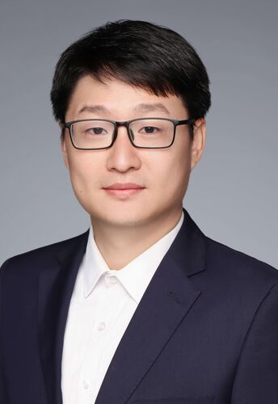
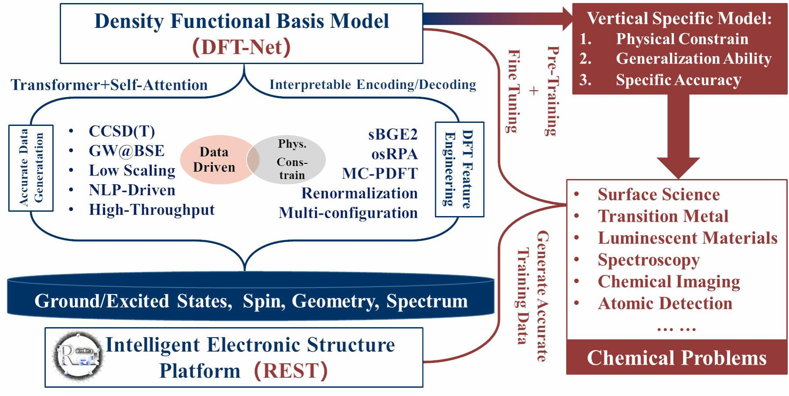

# Igor Ying Zhang

  

    
  

  

    
Professor at Fudan University &middot; Deputy Director, RCCT

    
Prof. Igor Ying Zhang received his B.S. from Xiamen University (2003) and dual Ph.D. degrees from Xiamen University (2010) and KTH Royal Institute of Technology, Sweden (2011). He conducted postdoctoral research at the Fritz Haber Institute of the Max Planck Society (2012–2014), where he established his independent research group. In 2018, he joined Fudan University as a Professor of Chemistry. His research focuses on theoretical and computational chemistry, with original contributions to the development and application of electronic structure methods and software. He has authored 80+ papers and published the first monograph on doubly hybrid functionals (<em>A New-Generation Density Functional</em>, Springer).

    

      
📑 Grants: NSFC Distinguished Young Scholar, NSFC Major Program, Overseas High-Level Talent Program

      
🏆 Awards: CCS Tang Aoqing Youth Award in Theoretical Chemistry (2018), MOE Natural Science First Prize (2019)

      
📧 igor_zhangying@fudan.edu.cn

      
🌐 <a href="https://www.scholarmate.com/P/6VJf2q">ScholarMate Profile</a> &middot; <a href="https://orcid.org/0000-0002-8703-1912">ORCID</a>

    

  

---

## Recent Activities

  

    May 2026
    Workshop
  

  <h4><a href="../announcements/rest-workshop-2026.html">3rd REST Program Workshop — First Announcement</a></h4>
  
The 3rd REST Program Workshop will be held on <strong>July 4–5, 2026</strong> in Shanghai. The workshop will focus on surface/interface simulations, new method extensions, and hands-on training with the REST platform.

---

## Research Focus

Developing high-accuracy density functional theory methods and software for challenging chemical problems.

- **Doubly Hybrid Functionals (xDH & R-xDH):** Principal founder of XYG3-type functionals achieving chemical accuracy for main-group and strongly correlated systems.
- **Cross-Entropy Corrected MC-PDFT:** A generalized hybrid multiconfiguration pair-density functional theory (HMC-PDFT) for strong correlation, delivering CASPT2-level accuracy at CASSCF cost.
- **High-Performance Software:** Led the development of **REST**, the first Rust-based electronic structure package.

---

## Team & Projects

- **[Research Group & Members](./group.md)** — Meet our team
- **[Ongoing Projects](./projects.md)** — Current research topics

  

    
  

- **REST Electronic Structure Package** — The world's first Rust-based quantum chemistry platform. [Download here](./rest_download.md) | [Source Code](https://gitee.com/restgroup)

  

    
  

---

## Contact

**Address:** Department of Chemistry, Fudan University, 2005 Songhu Road, Shanghai  
**Email:** igor_zhangying@fudan.edu.cn | **ORCID:** 0000-0002-8703-1912

---

## Selected Publications

1. Zhang, I. Y.; Xu, X. *A New-Generation Density Functional*, **Springer**, 2014.
2. Li, Z.; Gao, T.; Wang, S.; ...; Zhang, I. Y.; Xu, X. REST: Embracing Rust for Modern Electronic Structure Theory. *Chin. J. Chem. Phys.* **2025**. [doi](https://cjcp.ustc.edu.cn/hxwlxb/article/doi/10.1063/1674-0068/cjcp2510156)
3. Zhang, Y.; Xu, X.; Goddard, W. A. *PNAS* **2009**, *106*, 4963.
4. Zhang, I. Y.; Xu, X.; Jung, Y.; Goddard, W. A. *PNAS* **2011**, *108*, 19896.
5. Zhang, I. Y.; Rinke, P.; Perdew, J. P.; Scheffler, M. *Phys. Rev. Lett.* **2016**, *117*, 133002.
6. Zhang, I. Y.; Xu, X. *WIREs Comput. Mol. Sci.* **2021**, *11*, e1490.
7. Wang, Y.; Li, Y.; Chen, J.; Zhang, I. Y.; Xu, X. *JACS Au* **2021**, *1*, 543.
8. Wang, Y.; Lin, Z.; Ouyang, R.; Jiang, B.; Zhang, I. Y.; Xu, X. *JACS Au* **2024**, *4*, 3205.
9. Feng, R.; Zhang, I. Y.; Xu, X. *Nat. Commun.* **2025**, *16*, 235.
10. Cai, S.; Weng, J.; Zhang, I. Y.; Zhu, Y. *JACS Au* **2025**, *5*, 4491.

*Full list: [Google Scholar](https://scholar.google.com/citations?user=LvJYWPwAAAAJ&hl=en) | [Scholarmate](https://www.scholarmate.com/psnweb/homepage/show?module=pub)*

---

**© 2025 Zhang Research Group**
